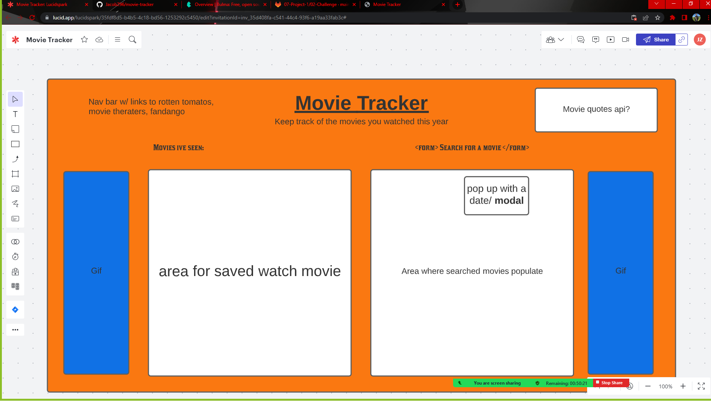

# movie-tracker

## Description 
Being a fan of movies, one might want to keep track of which movies they have seen throught the year. 
With this app you are able to search for a specific movie and add it to a list that will keep track of what movies you have watched and what day they were watched on. 

## Applications Used: 
* https://bulma.io/documentation/overview/
* https://www.omdbapi.com/
* https://day.js.org/en/

## User Story  
* As a movie fan 
* I want to be able to keep track of what movies I've watched this year
* So that I can have a list handy so i can give out recommendation

## Acceptance Criteria 
* Given a movie tracker with an form input
* Then I search for a movie
* When I search for a given movie 
* Then I am given IMDB data on that movie
* When I select that movie 
* Then I can choose which day I watched that movie
* When I choose which day 
* Then I add the movie to a list 

## Live Link 
https://jacobz96.github.io/movie-tracker/
## Screenshot 

## Authors 
* Iaroslav Lasiichuk
* Axel Iras 
* Sutton Charpentier
* Jacob Zea
